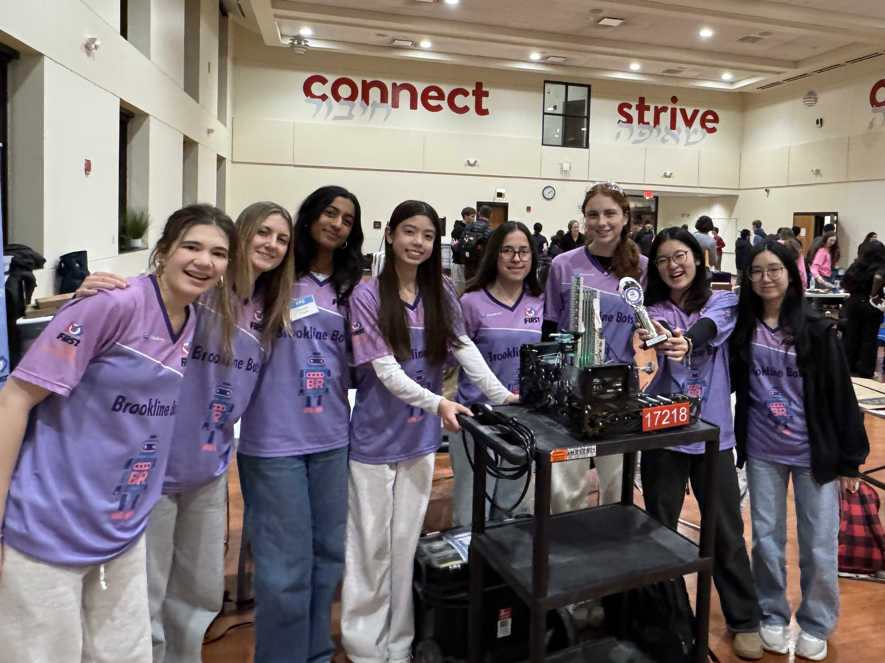

<link rel="stylesheet" href="/assets/css/buttonHover.css">

<h1 style="text-align:center">
    Welcome!
</h1>

 We are the Brookline Bots, Team 17218, based out of Brookline, Massachusetts. The team is made up of many students attending Brookline High School, 2 coaches, several amazing mentors, and multiple gracious corporate sponsors! Our team is dedicated to [FIRST](https://www.firstinspires.org/) (For Inspiration and Recognition of Science and Technology), our community, and working hard to encourage [STEM](http://www.brooklinerobotics.org/) (Science, Technology, Engineering, and Math) topics within our community. The Brookline Bots are looking forward to competing in each and every FTC Season. To learn more about our team, check out the About Us section of our website!

**Check back here often for events, competitions, and general team information!**

---

    

---

 

<h2 style="color:#5777a8; text-align:center; font-family:Dongle, Roboto, sans-serif; font-size: 500%">About us</h2>

<buttonhover class="noWrap full-rounded" onclick="teamFocus()">Team Focus

</buttonhover>
<buttonhover class="noWrap full-rounded" onclick="missionStatement()">Mission Statement

</buttonhover>
<buttonhover class="noWrap full-rounded" onclick="teamHistory()">Team History

</buttonhover>

 
      The Brookline Bots are dedicated to advancing STEM education through robotics in the Brookline community! Our mission is to inspire and empower students in Brookline by providing hands-on experiences in science, technology, and engineering. Through collaboration with mentors, teachers, and local organizations, we strive to create opportunities for students to develop critical problem-solving and leadership skills by expanding the reach of FIRST programs to underrepresented groups and supporting teams at all levels.

 
      

        We’re not just here to compete—we’re here to create a wave of opportunity. Our mission is to expand access to FIRST Tech Challenge in our community by mentoring future teams, uplifting young innovators, and showing that anyone can thrive in STEM.

 
  

     Over the years, the Brookline Bots have had many significant achievements. We've attended many competitions over the years, from local qualifiers to state championships. We haven't kept quiet about what we do either. You can find the Brookline Bots spreading the message of FIRST within our community by attending galas, networking nights, and hosting booths at local schools' STEM nights. Team 17218, the Brookline Bots has accomplished much since our founding year.
  

